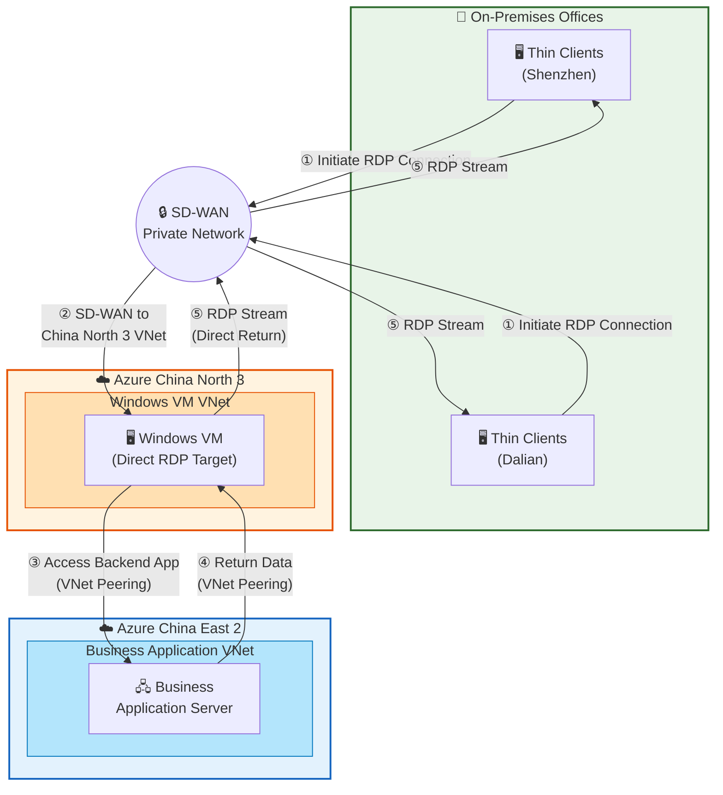

# Direct RDP Architecture — Without Azure Virtual Desktop (AVD)

## Overview

This architecture presents an alternative approach where thin clients connect **directly to a Windows VM** in Azure China North 3 via standard RDP, without leveraging Azure Virtual Desktop (AVD) services. The underlying network topology — SD-WAN, VNet Peering, and backend application connectivity — remains identical to the AVD-based architecture.

## Architecture Diagram

## Components

| Component | Location | Description |
|---|---|---|
| **Thin Clients** | Shenzhen / Dalian Offices | End-user devices running a standard RDP client (e.g., Microsoft Remote Desktop, mstsc.exe) |
| **SD-WAN** | On-Premises ↔ Azure | Private WAN connectivity between office sites and Azure China North 3 VNet |
| **Windows VM** | Azure China North 3 | Standalone Windows VM serving as the direct RDP target for remote users |
| **Business Application Server** | Azure China East 2 | Backend business application accessed by the Windows VM |
| **VNet Peering (Cross-Region)** | China East 2 ↔ China North 3 | Global VNet peering connecting the Windows VM VNet and business app VNet |

## Access Flow (End-to-End)

### ① Client Initiates RDP Connection

Users at the **Shenzhen** or **Dalian** office launch a standard **RDP client** (e.g., `mstsc.exe` or Microsoft Remote Desktop) on their thin client devices. They connect directly to the Windows VM's private IP address in Azure China North 3.

### ② SD-WAN Routes to Azure China North 3

The RDP connection request is routed through the enterprise **SD-WAN** network, which provides private connectivity from the office locations directly to the **Windows VM VNet** in Azure China North 3. The SD-WAN must have a route to the China North 3 VNet (either directly or via China East 2 with VNet peering transit).

### ③ Windows VM Accesses Backend Business Application

Once the user is working within the **Windows VM**, they access backend **business applications** deployed in Azure China East 2. This traffic flows over **cross-region VNet Peering** between the VM VNet (China North 3) and the Business Application VNet (China East 2).

### ④ Backend Application Returns Data

The **Business Application Server** in China East 2 processes the request and returns data back to the **Windows VM** in China North 3 over the same **VNet Peering** connection.

### ⑤ RDP Stream Returns to Client

The Windows VM streams the **RDP session output** (display, audio, clipboard) directly back to the thin client through the **SD-WAN** network. This is a persistent bidirectional RDP stream over TCP/UDP port 3389.

## Network Connectivity Summary

| Segment | Connection Type | Privacy |
|---|---|---|
| Office → Azure China North 3 | SD-WAN | ✅ Private |
| Client ↔ Windows VM | Direct RDP (port 3389) via SD-WAN | ✅ Private |
| Windows VM → Business App | VNet Peering (cross-region) | ✅ Private |
| Business App → Windows VM | VNet Peering (cross-region) | ✅ Private |

> **No Azure Entra ID authentication is required** in this architecture. Users authenticate directly with the Windows VM using local or domain credentials (e.g., Active Directory). No public internet access is needed at any point.

---

## Comparison: AVD vs. Direct RDP

| Aspect | With AVD (Private Link) | Without AVD (Direct RDP) |
|---|---|---|
| **Connection Broker** | AVD control plane acts as a connection broker — users discover resources via workspace feed, and the gateway routes sessions to available hosts | No broker — users must know and directly target the VM's IP address or hostname |
| **Authentication** | Azure Entra ID (OAuth 2.0 / OpenID Connect) for identity; requires public internet access to Entra ID endpoints | Windows local accounts or on-premises Active Directory / NTLM / Kerberos; no public internet required |
| **Session Management** | AVD manages session allocation, load balancing across multiple session hosts, and automatic reconnection | No built-in session management — each user connects to a specific VM; no automatic failover or load balancing |
| **Multi-Session Support** | Windows 10/11 Enterprise **multi-session** allows multiple users to share a single VM efficiently | Standard Windows only supports **single concurrent RDP session** (unless using Windows Server with RDS CALs) |
| **Connection Security** | RDP traffic tunneled through AVD gateway via reverse connect; session hosts have **no inbound ports open** | RDP port 3389 must be **open inbound** on the VM's NSG for client connections (even if only from private IP ranges) |
| **Protocol Optimization** | RDP Shortpath (UDP), adaptive graphics encoding, multimedia redirection, Teams optimization | Standard RDP protocol only; no cloud-optimized encoding or Teams media offload |
| **Scaling** | Auto-scaling host pools — VMs can be started/stopped based on demand, reducing cost | Manual VM management — VMs must be running at all times or managed with custom automation |
| **Desktop Personalization** | FSLogix profile containers provide persistent user profiles across any session host | Profiles are local to each VM; no roaming without additional infrastructure |
| **Monitoring & Diagnostics** | AVD Insights (Azure Monitor integration), connection diagnostics, session latency metrics | No built-in monitoring — requires manual setup of RDP logging and performance counters |
| **Licensing** | Requires Microsoft 365 / Windows E3+ license for AVD entitlement | Requires Windows Server + RDS CALs for multi-user, or one Windows Pro/Enterprise license per VM for single-user |
| **Network Complexity** | Requires AVD Private Link setup (workspace + host pool private endpoints), DNS configuration, and SD-WAN routing to China East 2 | Simpler — only SD-WAN routing to the VM's VNet in China North 3 is needed |
| **Entra ID Dependency** | **Required** — Entra ID public endpoint must be reachable for authentication (`login.partner.microsoftonline.cn`) | **Not required** — no dependency on any public cloud identity service |
| **Use Case Fit** | Enterprise-grade virtual desktop for large user populations needing centralized management, compliance, and multi-session efficiency | Quick PoC, small teams, or scenarios where AVD overhead is not justified and a simple 1:1 VM-to-user mapping suffices |

### When to Choose AVD

- You need to support **many users** with centralized session management and load balancing.
- **Multi-session Windows** is required to optimize VM cost (multiple users per VM).
- Security policy mandates that VMs have **no inbound ports open** (reverse connect model).
- You require **FSLogix profiles**, Teams optimization, or multimedia redirection.
- Compliance requires **Azure Monitor / AVD Insights** for session auditing and diagnostics.

### When Direct RDP May Suffice

- **Small-scale PoC** or a limited number of users (1:1 user-to-VM mapping).
- The environment is **fully private** with no need for Entra ID integration.
- Simplicity is prioritized — no need for the overhead of AVD control plane, private endpoints, and DNS configuration.
- Users only need basic remote desktop access without advanced protocol optimizations.
- The organization already manages VMs through existing tooling and does not need AVD's auto-scaling or session management features.
