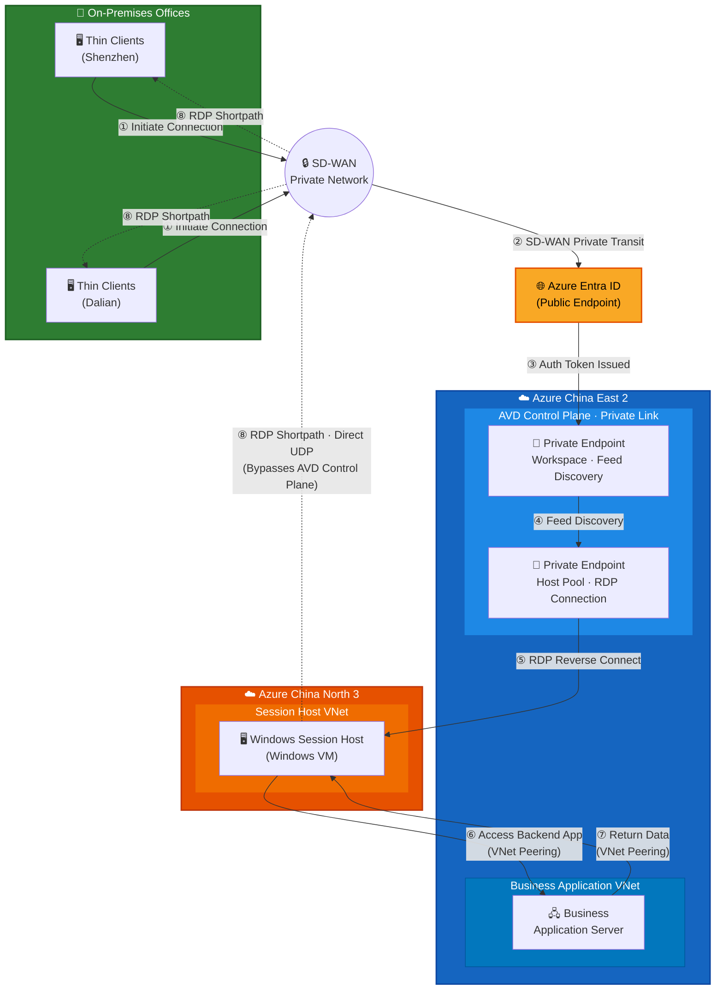

# Azure Virtual Desktop (AVD) Private Link Architecture

## Overview

This architecture demonstrates a fully private network connectivity solution for Azure Virtual Desktop (AVD) deployed on Azure China (21Vianet). End users access Windows session hosts through SD-WAN and AVD Private Link, ensuring that all AVD data-plane traffic remains on private networks. The only exception is **Azure Entra ID authentication**, which requires a public internet endpoint — this is a platform-level requirement that cannot be privatized.

## Architecture Diagram

## Components

| Component | Location | Description |
|---|---|---|
| **Thin Clients** | Shenzhen / Dalian Offices | End-user devices (thin clients) running Windows App (AVD client) |
| **SD-WAN** | On-Premises ↔ Azure | Private WAN connectivity between office sites and Azure China East 2 |
| **AVD Workspace Private Endpoint** | Azure China East 2 | Private endpoint for AVD feed discovery (workspace resource) |
| **AVD Host Pool Private Endpoint** | Azure China East 2 | Private endpoint for RDP session establishment (host pool resource) |
| **AVD Control Plane** | Azure China East 2 | AVD management and gateway services |
| **Windows Session Host** | Azure China North 3 | Windows VM enrolled in the AVD host pool, serving user desktop sessions |
| **Business Application Server** | Azure China East 2 | Backend business application accessed by the session host |
| **Azure Entra ID** | Public Endpoint (Internet) | Identity provider for user authentication; requires public network access |
| **VNet Peering (Cross-Region)** | China East 2 ↔ China North 3 | Global VNet peering connecting the session host VNet and business app VNet |

## Access Flow (End-to-End)

### ① Client Initiates Connection

Users at the **Shenzhen** or **Dalian** office launch the **Windows App** (AVD client) on their thin client devices. The client begins the connection process to access their virtual desktop.

### ② SD-WAN Private Transit to Azure & Entra ID Authentication

The connection request is routed through the enterprise **SD-WAN** network, which provides private, encrypted connectivity from the office locations toward Azure. Before accessing AVD resources, the client must authenticate with **Azure Entra ID** (formerly Azure Active Directory). Entra ID is a **public-facing identity service** — its authentication endpoints are only available over the **public internet**. The thin client reaches Entra ID's public endpoint to perform OAuth 2.0 / OpenID Connect authentication and obtain an access token.

> **⚠️ Important**: Azure Entra ID does not support private endpoints. Authentication traffic to `login.partner.microsoftonline.cn` (Azure China) **must** traverse the public internet. This is the **only segment** in the entire architecture that requires public network access. Organizations should ensure that firewall and proxy rules on the SD-WAN allow outbound HTTPS (port 443) to Entra ID endpoints.

### ③ Auth Token Issued & Feed Discovery via Workspace Private Endpoint

After successful authentication, Entra ID issues an **OAuth 2.0 access token** to the AVD client. Armed with this token, the client connects to the **Workspace Private Endpoint** in Azure China East 2 over the **private SD-WAN path**. Through this private endpoint, the client performs **feed discovery** — presenting the token and retrieving the list of available AVD resources (desktop sessions, remote apps) assigned to the user.

### ④ Feed Discovery & Resource Selection

The client retrieves the workspace feed through the Workspace Private Endpoint and presents the available desktops and applications to the user. The user selects the desired desktop resource to initiate an RDP session. The client then contacts the **Host Pool Private Endpoint** to begin session establishment.

### ⑤ RDP Session via Host Pool Private Endpoint (Reverse Connect)

After the user selects a desktop resource, the initial RDP session is established through the **Host Pool Private Endpoint** in Azure China East 2. AVD uses **reverse connect** technology — the session host in China North 3 maintains an outbound connection to the AVD gateway, and the RDP session is tunneled back through this path via the private endpoint. This ensures the session host does not require any inbound connectivity.

### ⑥ Session Host Accesses Backend Business Application

Once the user is working within the **Windows Session Host** (China North 3), they can access backend **business applications** deployed in Azure China East 2. This traffic flows over **cross-region VNet Peering** between the Session Host VNet (China North 3) and the Business Application VNet (China East 2), remaining entirely within Azure's private backbone network.

### ⑦ Backend Application Returns Data

The **Business Application Server** in China East 2 processes the request and returns data back to the **Session Host** in China North 3 over the same **VNet Peering** connection. The response traffic stays fully private on the Azure backbone.

### ⑧ RDP Shortpath — Direct Streaming to Client (Bypasses AVD Control Plane)

Once the initial RDP session is established, the session host negotiates **RDP Shortpath for managed networks**. This creates a **direct UDP-based connection** from the Session Host (China North 3) back to the thin client via **SD-WAN**, completely **bypassing the AVD control plane** in China East 2. This provides:
- **Lower latency**: Eliminates the extra hop through the AVD gateway.
- **Better performance**: Direct UDP transport is optimized for real-time desktop streaming.
- **Continued privacy**: The shortpath still travels over the private SD-WAN network — no public internet exposure.

## Network Connectivity Summary

| Segment | Connection Type | Privacy |
|---|---|---|
| Office → Azure (SD-WAN) | SD-WAN | ✅ Private |
| Client → Azure Entra ID | HTTPS to public endpoint | ⚠️ Public (required) |
| Client → AVD Workspace | Private Endpoint | ✅ Private |
| Client → AVD Host Pool | Private Endpoint | ✅ Private |
| AVD Gateway → Session Host | Reverse Connect (initial setup) | ✅ Private |
| Session Host → Business App | VNet Peering (cross-region) | ✅ Private |
| Business App → Session Host | VNet Peering (cross-region) | ✅ Private |
| Session Host → Client (Shortpath) | RDP Shortpath · Direct UDP via SD-WAN | ✅ Private |

> **All AVD data-plane traffic in this architecture stays on private networks.** The only exception is the authentication flow to Azure Entra ID, which requires public internet access to `login.partner.microsoftonline.cn`. This is a platform-level requirement that cannot be replaced with a private endpoint.

## Key Design Decisions

1. **AVD Private Link**: Both the workspace and host pool are configured with private endpoints, disabling public access entirely. This ensures that feed discovery and RDP connections are fully private.

2. **Cross-Region Deployment**: The AVD control plane is deployed in **China East 2** (where AVD service is available), while session hosts are placed in **China North 3** to be closer to specific workload requirements. Cross-region VNet peering bridges the two regions.

3. **SD-WAN Integration**: The enterprise SD-WAN provides private connectivity between office locations and the Azure VNet hosting the AVD private endpoints. DNS resolution for AVD endpoints is configured to resolve to private IP addresses.

4. **Reverse Connect**: Session hosts use AVD's reverse connect transport, meaning they only make outbound connections to the AVD gateway. No inbound ports need to be opened on the session host VMs.

5. **RDP Shortpath for Managed Networks**: After the initial session is established via reverse connect, the session host negotiates a direct UDP path (RDP Shortpath) back to the client through the SD-WAN. This bypasses the AVD gateway for ongoing desktop streaming, reducing latency and improving user experience while maintaining full private network connectivity.

6. **Azure Entra ID — Public Endpoint Requirement**: Azure Entra ID (formerly Azure AD) serves as the identity provider for AVD authentication. Unlike AVD workspace and host pool resources, Entra ID **does not support private endpoints** — its authentication endpoints (`login.partner.microsoftonline.cn` for Azure China) are exclusively available over the public internet. This is the only component in the architecture that requires public network access. Network security policies must allow outbound HTTPS (TCP 443) from the client network to Entra ID endpoints. All subsequent AVD operations (feed discovery, RDP sessions, data access) remain fully private after the authentication token is obtained.
